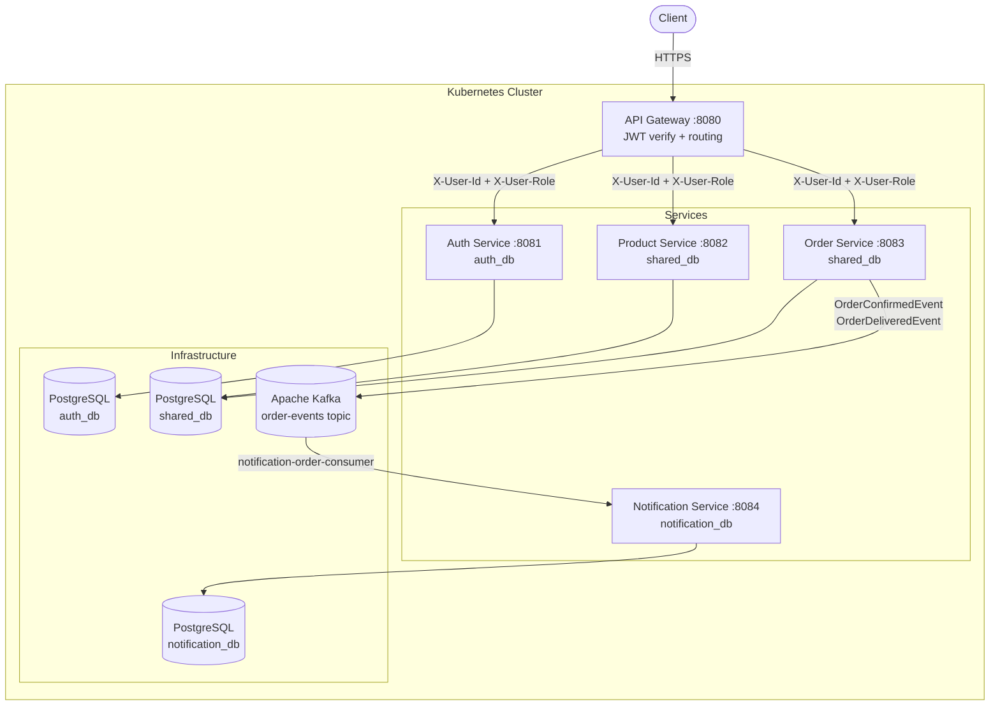
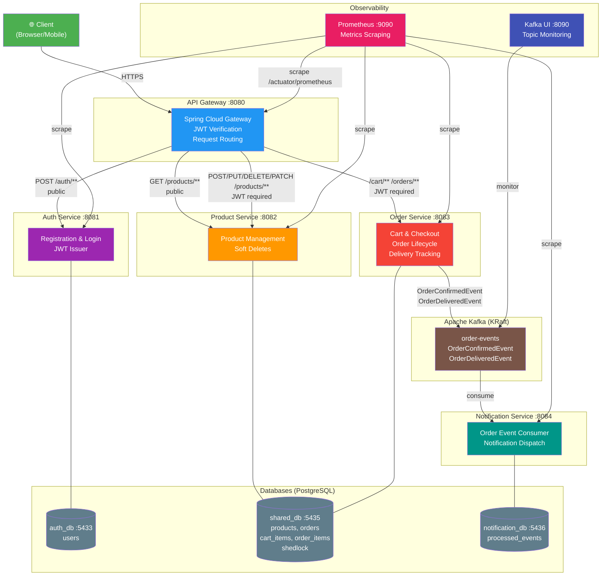

# OmniShop

A microservices-based online shopping system built with Spring Boot 3.5, PostgreSQL, Apache Kafka, and Docker.

---

## Table of Contents

1. [Architecture](#1-architecture)
2. [Quick Start](#2-quick-start)
3. [API Reference](#3-api-reference)
4. [Kafka Events](#4-kafka-events)
5. [Fake Payment Test Cards](#5-fake-payment-test-cards)
6. [Fake Delivery Timeline](#6-fake-delivery-timeline)
7. [Environment Variables](#7-environment-variables)
8. [Running in Kubernetes](#8-running-in-kubernetes)

---

## 1. Architecture

```
                          ┌─────────────────────────────────────────────────────────┐
                          │                    Docker Network                        │
                          │                                                          │
  Browser / curl          │   ┌─────────────────────────────────────────────┐       │
       │                  │   │              api-gateway :8080               │       │
       │  HTTP :8080       │   │  - JWT validation (JwtAuthFilter)            │       │
       └──────────────────┼──▶│  - Strips & re-injects X-User-Id,            │       │
                          │   │    X-User-Role headers                       │       │
                          │   │  - Routes /auth/** /products/** /cart/**     │       │
                          │   │    /orders/**                                │       │
                          │   └────────────┬────────────────────────────────┘       │
                          │                │ routes                                  │
                          │     ┌──────────┼──────────┬──────────────┐              │
                          │     ▼          ▼          ▼              ▼              │
                          │  ┌──────┐ ┌─────────┐ ┌───────┐ ┌──────────────┐       │
                          │  │ auth │ │ product │ │ order │ │notification  │       │
                          │  │:8081 │ │  :8082  │ │ :8083 │ │    :8084     │       │
                          │  └──┬───┘ └────┬────┘ └───┬───┘ └──────┬───────┘       │
                          │     │          │           │            │               │
                          │     ▼          ▼           ▼            │               │
                          │  ┌──────┐ ┌──────────────────────┐ ┌──────────────┐    │
                          │  │ PG   │ │          PG          │ │      PG      │    │
                          │  │:5433 │ │        :5435         │ │    :5436     │    │
                          │  │auth  │ │       shared         │ │notification  │    │
                          │  └──────┘ └──────────────────────┘ └──────────────┘    │
                          │                                          │               │
                          │   Kafka Topics (KRaft, no ZooKeeper)     │               │
                          │                                          │               │
                          │   order-service ──[order-events]──▶ notification-service│
                          │                        topic carries:                    │
                          │                        • OrderConfirmedEvent             │
                          │                        • OrderDeliveredEvent             │
                          │                                                          │
                          └─────────────────────────────────────────────────────────┘

  Prometheus :9090  scrapes /actuator/prometheus on all 5 services
```





### Gateway routing rules

| Prefix | Method | JWT required |
|---|---|---|
| `/auth/**` | any | No |
| `/products/**` | GET | No |
| `/products/**` | POST, PUT, DELETE, PATCH | Yes |
| `/cart/**` | any | Yes |
| `/orders/**` | any | Yes |

---

## 2. Quick Start

### Prerequisites

- Docker 24+ and Docker Compose v2
- (Optional) Java 21 + Maven 3.9 for local development

### Steps

```bash
# 1. Clone the repository
git clone <repo-url>
cd omnishop-project

# 2. Create your .env file from the example
cp .env.example .env
# Edit .env if you want custom credentials:
#   DB_USER     — Postgres username (default: postgres)
#   DB_PASS     — Postgres password (default: postgres)
#   JWT_SECRET  — HMAC signing key, must be ≥32 characters

# 3. Build images and start the full stack
docker-compose up --build

# 4. Wait ~60 s for all services to pass their health checks
#    The gateway starts last and only after all backends are healthy.
#    You can watch progress with:
docker-compose ps

# 5. Gateway is now available
curl http://localhost:8080/products
```

All services expose Swagger UI at their own port:

| Service | Swagger UI |
|---|---|
| auth-service | http://localhost:8081/swagger-ui/index.html |
| product-service | http://localhost:8082/swagger-ui/index.html |
| order-service | http://localhost:8083/swagger-ui/index.html |
| api-gateway (aggregated) | http://localhost:8080/swagger-ui/index.html |

To stop and remove containers:

```bash
docker-compose down
# Add -v to also delete Postgres data volumes:
docker-compose down -v
```

---

## 3. API Reference

All write endpoints require a `Bearer <token>` header obtained from `POST /auth/login`.  
The gateway validates the token and injects `X-User-Id` and `X-User-Role` headers before forwarding.

### 3.1 Authentication (`auth-service` — no JWT required)

| Method | Path | Auth | Role | Request Body | Response | Notes |
|---|---|---|---|---|---|---|
| POST | `/auth/register` | No | — | `{"username":"alice","password":"pass1234"}` | `201 No body` | Creates customer account |
| POST | `/auth/register/seller` | No | — | `{"username":"bob","password":"pass1234"}` | `201 No body` | Creates seller account |
| POST | `/auth/login` | No | — | `{"username":"alice","password":"pass1234"}` | `200 LoginResponse` | Returns JWT valid 24 h |

**LoginResponse:**
```json
{
  "token": "eyJhbGc...",
  "userId": "3fa85f64-5717-4562-b3fc-2c963f66afa6",
  "role": "ROLE_CUSTOMER",
  "expiresIn": 86400
}
```

### 3.2 Products (`product-service`)

| Method | Path | Auth | Role | Request Body | Response | Notes |
|---|---|---|---|---|---|---|
| GET | `/products` | No | — | — | `200 Page<ProductSummary>` | `?search=&page=0&size=10` (max size 50) |
| GET | `/products/{id}` | No | — | — | `200 ProductResponse` | Returns full product details including quantity |
| POST | `/products` | Yes | ROLE_SELLER | `ProductRequest` | `201 ProductResponse` | Creates product with initial stock |
| PUT | `/products/{id}` | Yes | ROLE_SELLER | `ProductRequest` | `200 ProductResponse` | Only original seller may update |
| DELETE | `/products/{id}` | Yes | ROLE_SELLER | — | `204 No body` | Soft delete; record retained. Only owner may delete |
| GET | `/products/{id}/quantity` | Yes | ROLE_SELLER | — | `200 StockResponse` | Owner-only |
| PUT | `/products/{id}/quantity` | Yes | ROLE_SELLER | `{"quantity":100}` | `200 StockResponse` | Sets absolute stock level. Owner-only |
| PATCH | `/products/{id}/quantity/add` | Yes | ROLE_SELLER | `{"quantity":50}` | `200 StockResponse` | Increments stock. Owner-only |

**ProductRequest:**
```json
{
  "name": "Wireless Keyboard",
  "description": "Compact mechanical keyboard",
  "price": 49.99,
  "quantity": 100
}
```

**ProductResponse:**
```json
{
  "id": "3fa85f64-5717-4562-b3fc-2c963f66afa6",
  "sellerId": "a1b2c3d4-...",
  "name": "Wireless Keyboard",
  "description": "Compact mechanical keyboard",
  "price": 49.99,
  "quantity": 100,
  "createdAt": "2026-04-24T10:00:00"
}
```

**StockResponse:**
```json
{
  "sellerId": "a1b2c3d4-...",
  "productId": "3fa85f64-...",
  "quantity": 150
}
```

### 3.3 Cart (`order-service`)

| Method | Path | Auth | Role | Request Body | Response | Notes |
|---|---|---|---|---|---|---|
| POST | `/cart/items` | Yes | any | `{"productId":"<uuid>","quantity":2}` | `200 CartResponse` | Increments quantity if product already in cart |
| GET | `/cart` | Yes | any | — | `200 CartResponse` | Shows live prices from product-service |
| PUT | `/cart/items/{productId}` | Yes | any | `{"productId":"<uuid>","quantity":3}` | `200 CartResponse` | Replaces quantity; use 0 to remove |
| DELETE | `/cart/items/{productId}` | Yes | any | — | `200 CartResponse` | Removes single product line |
| DELETE | `/cart` | Yes | any | — | `204 No body` | Empties the cart |

**CartResponse:**
```json
{
  "items": [
    {
      "productId": "3fa85f64-...",
      "name": "Wireless Keyboard",
      "quantity": 2,
      "unitPrice": 49.99,
      "subtotal": 99.98,
      "available": true
    }
  ],
  "itemCount": 1,
  "totalAmount": 99.98
}
```

### 3.4 Orders (`order-service`)

| Method | Path | Auth | Role | Request Body | Response | Notes |
|---|---|---|---|---|---|---|
| POST | `/orders/checkout` | Yes | ROLE_CUSTOMER | `{"cardNumber":"4242424242424242"}` | `201 OrderResponse` | Validates card, deducts stock atomically, publishes `order-events`. Status starts CONFIRMED |
| GET | `/orders/my-orders` | Yes | any | — | `200 Page<OrderSummary>` | `?status=CONFIRMED&page=0&size=10` |
| GET | `/orders/{orderId}` | Yes | any | — | `200 OrderResponse` | Returns full order with line items. Owner-only |
| DELETE | `/orders/{orderId}` | Yes | ROLE_CUSTOMER | — | `204 No body` | Cancels CONFIRMED order, publishes `order-events`. Owner-only |

**OrderResponse:**
```json
{
  "id": "7c9e6679-...",
  "userId": "3fa85f64-...",
  "status": "CONFIRMED",
  "deliveryStatus": "PREPARING",
  "estimatedDelivery": "2026-04-24T10:12:00",
  "totalAmount": 99.98,
  "createdAt": "2026-04-24T10:00:00",
  "items": [
    {
      "productId": "3fa85f64-...",
      "quantity": 2,
      "priceAtPurchase": 49.99
    }
  ]
}
```

**OrderStatus values:** `CONFIRMED` or `CANCELLED`  
**DeliveryStatus values:** `PREPARING` → `SHIPPED` → `DELIVERED` (or `CANCELLED`)

### 3.5 Error Response (all services)

Every error returns the same JSON shape:

```json
{
  "timestamp": "2026-04-24T10:05:00.123",
  "status": 403,
  "error": "Forbidden",
  "message": "Access denied to order: 7c9e6679-...",
  "path": "/orders/7c9e6679-..."
}
```

---

## 4. Kafka Events

One topic is used. It is created automatically by order-service on startup with 3 partitions and replication factor 1.

### Topic: `order-events`

**Producer:** order-service only  
**Consumer:** notification-service only

Three event types are published to this topic, each carrying a `"type"` discriminator field used by the consumer to route to the correct handler.

#### OrderConfirmedEvent — published on every successful checkout

```json
{
  "type": "CONFIRMED",
  "eventId": "f47ac10b-58cc-4372-a567-0e02b2c3d479",
  "orderId": "7c9e6679-7b5b-4f85-9c4e-9f3df5f5a4a1",
  "customerId": "3fa85f64-5717-4562-b3fc-2c963f66afa6",
  "sellerId": "a1b2c3d4-...",
  "items": [
    { "productId": "a3bb189e-...", "productName": "Wireless Keyboard", "quantity": 2, "priceAtPurchase": 49.99 }
  ],
  "totalAmount": 99.98,
  "confirmedAt": "2026-04-30T10:00:00"
}
```

#### OrderDeliveredEvent — published when order transitions to DELIVERED

```json
{
  "type": "DELIVERED",
  "eventId": "d67b2190-65aa-42ec-a945-5fd21dec0538",
  "orderId": "7c9e6679-7b5b-4f85-9c4e-9f3df5f5a4a1",
  "customerId": "3fa85f64-...",
  "estimatedDelivery": "2026-04-30T10:10:00"
}
```

> notification-service uses a single `@KafkaListener` that deserializes the raw JSON string and dispatches by `type` field. Duplicate events are suppressed via a PostgreSQL-backed `processed_events` table in `notification_db` — idempotency survives service restarts.

---

## 5. Fake Payment Test Cards

The payment service validates the card number in three stages:

1. **Format** — must be exactly 16 digits (no spaces, no dashes).
2. **Luhn algorithm** — standard credit card checksum validation.
3. **Decline rules** — hardcoded switch statement checked after Luhn passes.

| Card Number | Luhn Valid | Result | Error Message |
|---|---|---|---|
| `4532015112830366` | Yes | **Accepted** | — |
| `4242424242424242` | Yes | **Accepted** | — |
| `0000000000000000` | Yes | **Declined** — Insufficient funds | `"Insufficient funds"` (HTTP 400) |
| `1111111111111111` | Yes | **Declined** — Card expired | `"Card expired"` (HTTP 400) |
| `2222222222222222` | Yes | **Declined** — Card stolen or blocked | `"Card stolen or blocked"` (HTTP 400) |
| `1234` | N/A | **Rejected** — wrong length | `"Card must be 16 digits"` (HTTP 400) |
| `1234567890123456` | No | **Rejected** — bad checksum | `"Invalid card number"` (HTTP 400) |
| _(empty)_ | N/A | **Rejected** — blank | `"cardNumber: must not be blank"` (HTTP 400) |

---

## 6. Fake Delivery Timeline

The delivery simulation is driven entirely by schedulers inside order-service. No external input is needed — just place an order and watch the status change.

### State machine

```
Order placed (checkout)
      │
      │ order-service validates card + deducts stock atomically
      │ publishes OrderConfirmedEvent to order-events
      ▼
 status=CONFIRMED, deliveryStatus=PREPARING
 estimatedDelivery = now + 5–15 minutes
      │
      │ DeliveryScheduler runs every 30 s
      │ Advances orders where PREPARING and updatedAt > 1 min ago
      ▼
 deliveryStatus=SHIPPED
      │
      │ DeliveryScheduler runs every 30 s
      │ Advances orders where SHIPPED and estimatedDelivery has passed
      │ publishes OrderDeliveredEvent to order-events
      ▼
 deliveryStatus=DELIVERED
```

### Approximate wall-clock times (after checkout)

| Stage | Approximate time |
|---|---|
| Checkout → CONFIRMED | immediate (synchronous stock deduction) |
| CONFIRMED + PREPARING | ~1–2 min (scheduler delay + 1-min guard) |
| PREPARING → SHIPPED | within 30 s of 1-min guard expiring |
| SHIPPED → DELIVERED | 1–5 min after SHIPPED (random estimated delivery window) |

### Background jobs

| Job | Schedule | Description |
|---|---|---|
| `DeliveryScheduler` | Every 30 s | Advances PREPARING → SHIPPED (no event) and SHIPPED → DELIVERED; publishes `OrderDeliveredEvent` on DELIVERED transition. Protected by ShedLock — prevents duplicate runs across replicas |
| `CartCleanupJob` | Daily at 03:00 | Deletes cart items not updated in the last 7 days. Protected by ShedLock. |

---

## 7. Environment Variables

| Variable | Service(s) | Default | Description |
|---|---|---|---|
| `DB_USER` | auth, product, order, notification | `postgres` | PostgreSQL username |
| `DB_PASS` | auth, product, order | `postgres` | PostgreSQL password |
| `DB_PASS` | notification-service | `postgres` | PostgreSQL password for notification_db |
| `JWT_SECRET` | auth-service, api-gateway | `superSecretKey123OfAtLeast32Characters` | HMAC-SHA256 signing key. Must be identical in both services. Minimum 32 characters. |
| `KAFKA_BOOTSTRAP_SERVERS` | order-service, notification-service | `localhost:9092` | Kafka bootstrap server address. In Docker: `omnishop-kafka:9092` |
| `PRODUCT_HOST` | api-gateway | `localhost` | Hostname for product-service routing |
| `AUTH_HOST` | api-gateway | `localhost` | Hostname for auth-service routing |
| `ORDER_HOST` | api-gateway | `localhost` | Hostname for order-service routing |
| `DB_URL` | auth, product, order | _(none)_ | Full JDBC URL override used by Docker Compose to point each service at its container's port 5432 |
| `DB_URL_NOTIFICATION` | notification-service | `jdbc:postgresql://localhost:5436/notification_db` | JDBC URL for notification_db |

### Local development defaults (without Docker)

| Service | DB URL |
|---|---|
| auth-service | `jdbc:postgresql://localhost:5433/auth_db` |
| product-service | `jdbc:postgresql://localhost:5435/shared_db` |
| order-service | `jdbc:postgresql://localhost:5435/shared_db` |
| notification-service | `jdbc:postgresql://localhost:5436/notification_db` |

---

## 8. Running in Kubernetes

The `k8s/` directory contains manifests for deploying the full stack on a Kubernetes cluster (tested with `kubectl` 1.29+).

### What is created

| File | Resources |
|---|---|
| `secrets.yaml` | `omnishop-secrets` (DB_PASS, JWT_SECRET) |
| `configmaps.yaml` | `omnishop-config` (DB_USER, hostnames, Kafka address, SHARED_DB_URL, NOTIFICATION_DB_URL) |
| `postgres-auth-deploy.yaml` | PVC + Deployment + ClusterIP Service for auth DB (:5433) |
| `postgres-shared-deploy.yaml` | PVC + Deployment + ClusterIP Service for shared DB (:5435) |
| `postgres-notification-deploy.yaml` | PVC + Deployment + ClusterIP Service for notification DB (:5436) |
| `kafka-deploy.yaml` | KRaft Kafka Deployment + ClusterIP Service (`kafka-service:9092`) |
| `auth-deploy.yaml` | Deployment (1 replica) + ClusterIP Service |
| `product-service-deploy.yaml` | Deployment (2 replicas, stateless) + ClusterIP Service |
| `order-service-deploy.yaml` | Deployment (1 replica) + ClusterIP Service |
| `notification-service-deploy.yaml` | Deployment (1 replica) + ClusterIP Service |
| `gateway-deploy.yaml` | Deployment (1 replica) + **LoadBalancer** Service (port 80 → 8080) |

### Deploy

```bash
# Apply all manifests
kubectl apply -f k8s/

# Watch pods come up
kubectl get pods -w

# Check service endpoints
kubectl get svc
```

The gateway is exposed via a LoadBalancer service. Get the external IP:

```bash
kubectl get svc omnishop-gateway-service
# Use EXTERNAL-IP:80 as your API base URL
```

### Update the secrets before deploying to production

The default values in `k8s/secrets.yaml` are base64-encoded placeholders:

```bash
# Encode your own values
echo -n 'your-strong-password' | base64
echo -n 'your-jwt-secret-min-32-chars' | base64
# Replace the values in k8s/secrets.yaml before applying
```

### Scale product-service

product-service is a stateless service. It supports horizontal scaling:

```bash
kubectl scale deployment product-service --replicas=3
```

> Do not scale order-service above 1 replica. It uses ShedLock backed by a single PostgreSQL instance; multiple replicas would still work correctly (ShedLock prevents duplicate job execution), but there is no benefit beyond the first replica for the scheduler workloads.

---

## Observability

Prometheus scrapes `/actuator/prometheus` on all five application services and the gateway every 15 seconds.

```bash
# Start Prometheus alongside the stack (included in docker-compose.yml)
docker-compose up --build

# Open Prometheus UI
open http://localhost:9090
```

Standard Spring Boot metrics (`jvm_*`, `http_server_requests_*`, `process_*`) are exported by all services. Access per-service metrics directly:

| Service | Metrics URL |
|---|---|
| api-gateway | http://localhost:8080/actuator/prometheus |
| auth-service | http://localhost:8081/actuator/prometheus |
| product-service | http://localhost:8082/actuator/prometheus |
| order-service | http://localhost:8083/actuator/prometheus |
| notification-service | http://localhost:8084/actuator/prometheus |
